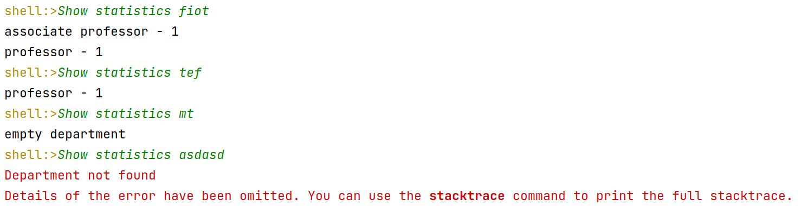

# University CLI
### Description
Spring Boot Java project with the console interface for university, which consists of departments and lectors. The lectors could work in more than one department. A lector could have one degree (assistant, associate professor, professor).
### Commands
`Show statistics`: Shows stats for department (includes all employees). Empty department if no employees

`Who is head of department`: Shows the head of department. Head either can be an employee in his department or no

`Show the average salary for the department`: Shows average salary. 0 if no employees

`Show count of employee for`: Shows employee count in department

`Global search by`: Searches lectors with name and surname like template
### Example
